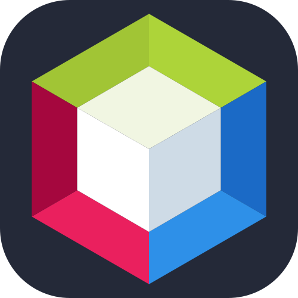

# Hi there! I'm Benjamin Tavarez 👋

### Ingeniero de Sistemas | Full Stack Developer

> _Diseñando soluciones elegantes para problemas complejos._

Bienvenido a mi espacio, donde comparto proyectos diseñados para resolver problemas reales a través de tecnología eficiente con una arquitectura impecable y elegancia tecnica.

## Sobre mi:

> Mi compromiso es impulsar el éxito de cada proyecto integrando mi experiencia en desarrollo Full Stack con una visión estratégica y organizativa, asegurando no solo la calidad del código, sino la transformacion de desafíos complejos en soluciones digitales de alto impacto , logrando una ejecución fluida que entregue resultados elegantes alineados con los objetivos del negocio.

- 🎓 Ingeniero de Sistemas Computacionales & Full Stack Developer
- ⚡ Perfil: Profesional enfocado en la resolución ágil de problemas y la evolución tecnológica constante.
- 🎯 Especialidad: Diseño y desarrollo de software basado en arquitecturas escalables.
- 🏛️ Filosofía: Crear soluciones robustas con una arquitectura limpia y **elegancia técnica**, priorizando siempre la experiencia del usuario.

## 🛠️ Tech Stack

### **Desarrollo Web (Core Full Stack)**

**Frontend:**       

**Backend & Databases:**    

### **Ingeniería de Sotware & Lenguajes Base**

**Lenguajes:**     

**Entornos de Desarrollo:**     

### **Herramientas & Diseño**

**DevOps & Gestión:**   

**Diseño & Multimedia:**   

**Testing & Quality Assurance:**      

---

> **"Obtengo la idea (Diseño & Multimedia), selecciono mis herramientas (DevOps), construyo cosas (Technical Stack) y me aseguro de que no se rompan (Testing)."**

---

  

---

 

